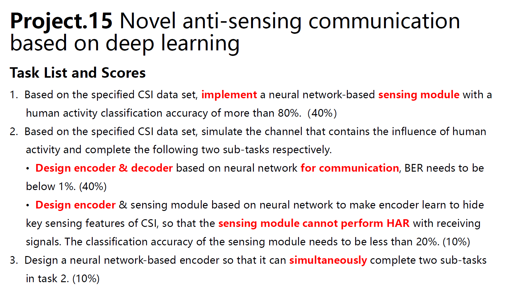

# Anti-Sensing-HAR-network
> This is the code for course project "Novel anti-sensing communication based on deep learning"

## Tasks Introduction
- Task 1: Efficient Detection Module for HAR
- Task 2: Encoder-Decoder Network with low BER & Encoder hiding sensing feature
- Task 3: Trade-off between privacy and accuracy
  - against fixed sensing module
  - against optimized sensing module

## Requirements

- [x] Task1: sensing module with a classification accuracy of more than 80%
  > [download model](https://jbox.sjtu.edu.cn/l/y1xjOK)
- [ ] Task2: encoder-decoder network with a BER of less than 10%
- [ ] encoder-decoder network with a BER of less than 10%
- [ ] Task3: anti-sensing encoder 
  - [ ] against fixed sensing module
  - [ ] against optimized sensing module
