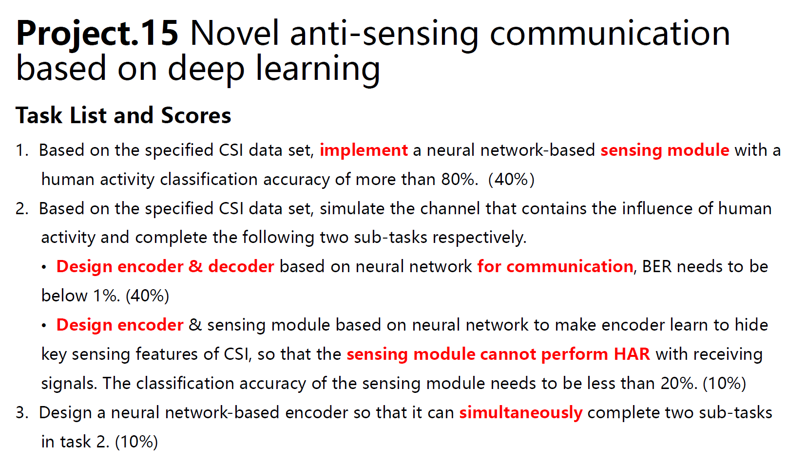

# Anti-Sensing-HAR-network
> This is the code for course project "Novel anti-sensing communication based on deep learning"

## Tasks Introduction
### Task 1: Efficient Detection Module for HAR
### Task 2: Encoder-Decoder Network with low BER & Encoder hiding sensing feature
### Task 3: Trade-off between privacy and accuracy

## Origin Requirements
